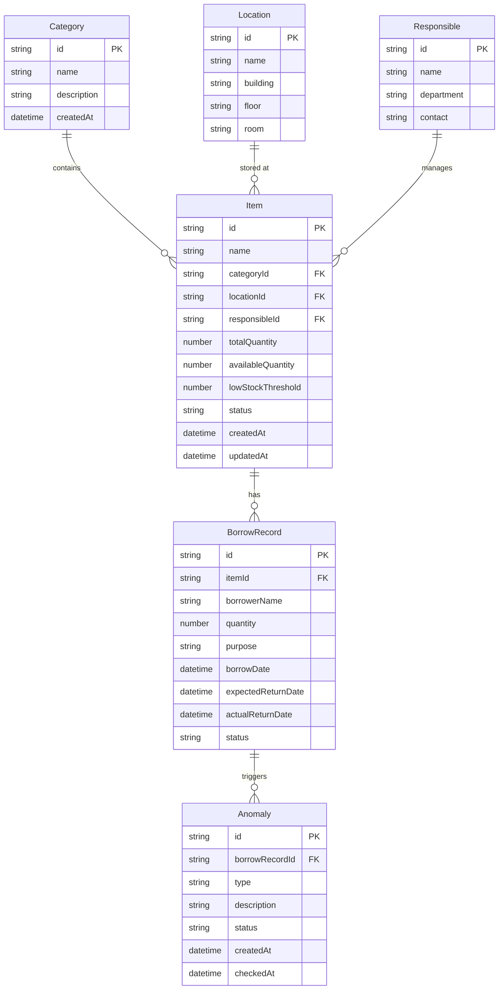

## 1. 架构设计

```mermaid
graph TB
    subgraph "前端层"
        "React + TypeScript" --> "Zustand 状态管理"
        "React + TypeScript" --> "React Router 路由"
        "React + TypeScript" --> "Tailwind CSS 样式"
    end
    subgraph "数据层"
        "Zustand Store" --> "IndexedDB 持久化"
        "Zustand Store" --> "内存状态（筛选/选择/角色）"
    end
    subgraph "角色权限层"
        "角色上下文" --> "管理员权限"
        "角色上下文" --> "普通用户权限"
        "角色上下文" --> "审计员权限"
    end
end
```

## 2. 技术说明

- 前端：React@18 + TypeScript + Tailwind CSS@3 + Vite
- 初始化工具：vite-init
- 后端：无（纯前端）
- 数据库：IndexedDB（浏览器端持久化）
- 状态管理：Zustand
- 路由：React Router DOM
- 图标：lucide-react

## 3. 路由定义

| 路由 | 用途 | 权限 |
|------|------|------|
| / | 物品总览页面（默认） | 所有角色 |
| /manage | 物品管理（分类/存放点/责任人） | 管理员 |
| /borrow | 领用登记页面 | 普通用户、管理员 |
| /audit | 异常核对页面 | 审计员、管理员 |

## 4. API 定义

无后端 API。所有数据操作通过 IndexedDB 直接在前端完成。

## 5. 数据模型

### 5.1 数据模型定义



### 5.2 IndexedDB 存储结构

- **Object Store: categories** — 物品分类
  - keyPath: `id`，索引: `name`

- **Object Store: locations** — 存放点
  - keyPath: `id`，索引: `name`

- **Object Store: responsibles** — 责任人
  - keyPath: `id`，索引: `name`, `department`

- **Object Store: items** — 物品
  - keyPath: `id`，索引: `categoryId`, `locationId`, `responsibleId`, `status`

- **Object Store: borrowRecords** — 领用记录
  - keyPath: `id`，索引: `itemId`, `borrowerName`, `status`

- **Object Store: anomalies** — 异常记录
  - keyPath: `id`，索引: `borrowRecordId`, `type`, `status`

## 6. 核心状态设计

### 6.1 筛选与选择状态（Zustand Store）

```
FilterState {
  category: string | null
  location: string | null
  responsible: string | null
  borrowStatus: string | null
  anomalyType: string | null
  searchQuery: string
}

SelectionState {
  selectedIds: Set<string>
  hiddenSelectedCount: number
}

RoleState {
  currentRole: 'admin' | 'user' | 'auditor'
}
```

### 6.2 批量操作边界处理逻辑

1. **筛选变更时**：
   - 检测 `selectedIds` 中是否有记录不在当前筛选结果中
   - 若有，弹出确认对话框：保留选择 / 清空被隐藏记录的选择
   - 用户确认后更新 `selectedIds`

2. **执行批量操作时**：
   - 仅对 `selectedIds` 中且在当前筛选结果中的记录执行操作
   - 若存在隐藏的选中记录，在操作栏显示警告提示
   - 操作完成后清除已处理记录的选择状态

3. **全选/取消全选**：
   - 全选仅选中当前筛选结果中的所有记录
   - 不影响被筛选隐藏的记录选择状态
